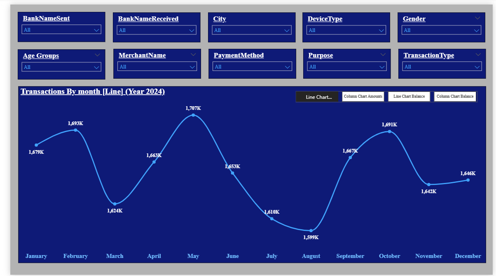
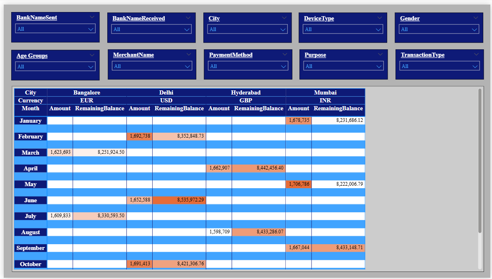
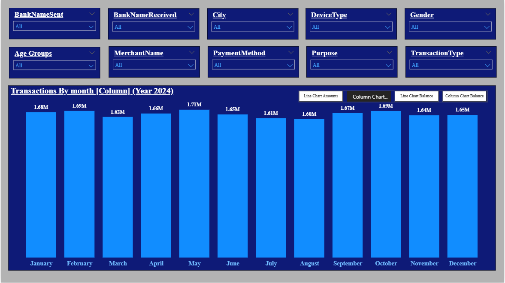
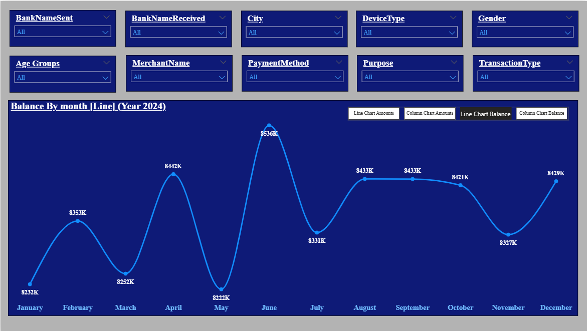
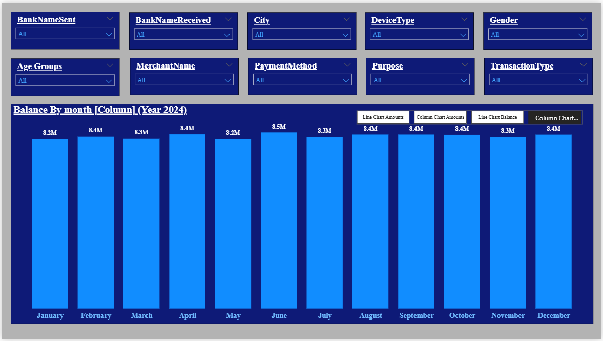
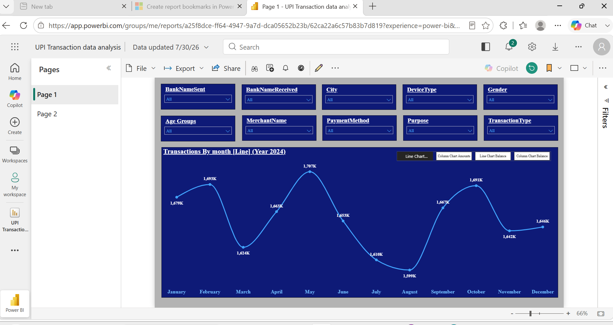

# UPI Transactions Data Analysis Dashboard

## Project Overview

This project presents an interactive UPI Transactions Data Analysis Dashboard developed using Microsoft Power BI.

The dashboard analyzes digital payment transactions across different months, cities, banks, merchants, customer groups, payment methods, transaction types, and devices. It allows users to explore transaction amounts and remaining balances through interactive slicers, matrix visuals, conditional formatting, and bookmark-based navigation.

The project was developed as a hands-on Power BI learning project to strengthen skills in data profiling, calculated columns, report interactivity, visualization, and business analysis.

---

## Dashboard Preview



---

## Tools and Technologies

- Microsoft Power BI Desktop
- Microsoft Excel
- Power Query
- DAX
- Power BI Bookmarks
- Conditional Formatting
- Power BI Service
- GitHub

---

## Dataset Description

The dataset contains approximately 20,000 sample UPI transaction records.

The main columns include:

- Transaction ID
- Transaction Date
- Transaction Amount
- Sender Bank
- Receiver Bank
- Remaining Balance
- City
- Gender
- Transaction Type
- Transaction Status
- Transaction Time
- Device Type
- Payment Method
- Merchant Name
- Transaction Purpose
- Customer Age
- Payment Mode
- Currency
- Customer Account Number
- Merchant Account Number

The account numbers and transaction records used in this project are sample data created for learning and analysis purposes.

---

## Problem Statement

The objective of this dashboard is to analyze UPI transaction activity and answer business questions such as:

- How do transaction amounts change from month to month?
- Which cities contribute to different transaction patterns?
- Which sender and receiver banks are used most frequently?
- How do transaction amounts vary across customer age groups?
- Which devices and payment methods are commonly used?
- Which merchants and transaction purposes generate higher activity?
- How do transaction amounts and remaining balances compare?
- How can users switch dynamically between different chart views?

---

## Steps Followed

### Step 1: Loading the data

Loaded the UPI Transactions Excel dataset into Power BI Desktop.

### Step 2: Data profiling

Opened Power Query Editor and enabled:

- Column Quality
- Column Distribution
- Column Profile

These options were used to examine valid, error, and empty values, as well as distinct values, unique values, minimum values, maximum values, and value distributions.

### Step 3: Data validation

Reviewed column names, data types, missing values, and possible errors before creating the report.

### Step 4: Slicer creation

Added interactive slicers for:

- Sender Bank
- Receiver Bank
- City
- Device Type
- Gender
- Age Group
- Merchant Name
- Payment Method
- Purpose
- Transaction Type

### Step 5: Slicer formatting

Formatted the slicers by adjusting:

- Height
- Width
- Horizontal position
- Vertical position
- Background
- Text appearance

### Step 6: Age-group calculated column

Created an Age Group calculated column using DAX and the Customer Age field.

Example:

```DAX
Age Groups =
IF(
    'UPI Transactions'[CustomerAge] <= 25,
    "A1",
    IF(
        'UPI Transactions'[CustomerAge] <= 35,
        "A2",
        "A3"
    )
)
```

This grouping helps compare transaction behaviour across customer age categories.

### Step 7: Monthly transaction chart

Created a line chart to display transaction amounts by month for the year 2024.

This visual helps identify monthly increases and decreases in UPI transaction activity.

### Step 8: Matrix visual

Created a matrix visual using:

- City
- Currency
- Month
- Transaction Amount
- Remaining Balance

This visual allows detailed comparison of transaction values across locations and currencies.

### Step 9: Conditional formatting

Applied conditional formatting to the matrix to highlight transaction amounts and remaining balances.

This makes unusually high or low values easier to identify.

### Step 10: Synchronizing slicers

Used the Sync Slicers feature so that selected filters remain consistent across multiple report pages.

### Step 11: Transaction bookmarks

Created bookmarks to switch between:

- Transaction Amount Line Chart
- Transaction Amount Column Chart

### Step 12: Remaining-balance bookmarks

Created additional bookmarks to switch between:

- Remaining Balance Line Chart
- Remaining Balance Column Chart

### Step 13: Bookmark navigation

Added buttons for bookmark navigation.

In Power BI Desktop, `Ctrl + Click` is used to activate bookmark buttons. In Power BI Service, the buttons can be selected directly.

### Step 14: Publishing to Power BI Service

Successfully published the report to Power BI Service in a personal workspace.

The report is visible and usable inside the personal Power BI Service account.

A public live report link is not included because the project was created using a free Power BI account, and the normal personal-workspace report link is not accessible to external users without permission.

The complete `.pbix` file and dashboard screenshots are available in this GitHub repository.

---

## Report Availability

- Power BI Desktop file: Available in this repository
- Dashboard screenshots: Available in the `Images` folder
- Power BI Service: Successfully published to a personal workspace
- Public live link: Not available because of free-account sharing limitations

---

## Dashboard Features

- Interactive slicers
- Synchronized slicers
- Monthly transaction analysis
- Matrix reporting
- Conditional formatting
- Age-group segmentation
- Bookmark-based chart switching
- Line and column chart views
- Transaction amount analysis
- Remaining balance analysis
- Multi-page report navigation
- Power BI Service publishing

---

## Report Pages

### Transaction Amount Analysis


This page displays monthly transaction amounts and allows users to filter the results by bank, city, device, gender, merchant, purpose, and transaction type.

### Matrix Analysis



The matrix presents city-wise and currency-wise transaction amounts and remaining balances for each month.

---

## Additional Bookmark Views

### Transaction Amount Column Chart



### Remaining Balance Line Chart



### Remaining Balance Column Chart



---

## Power BI Service Preview



The report was successfully published to Power BI Service in the personal workspace.

---

## Key Observations

- Monthly transaction values remain relatively stable but show visible peaks and declines during the year.
- May records the highest transaction amount in the displayed line chart.
- August records the lowest transaction amount in the displayed line chart.
- The synchronized slicers allow users to compare transaction behaviour across different customer and payment categories.
- The matrix provides a detailed comparison of transaction amounts and remaining balances across cities and currencies.
- Bookmark navigation improves usability by allowing users to switch between different visual views without overcrowding the report page.

The insights change dynamically when different slicer selections are applied.

---

## Business Value

This dashboard can help a digital payments or banking organization:

- Monitor monthly UPI transaction trends
- Compare transaction activity across cities
- Analyze sender and receiver bank usage
- Understand customer demographics
- Compare payment methods and devices
- Examine merchant and purpose-based transaction patterns
- Track remaining account balances
- Provide interactive self-service reporting to business users

---

## Skills Demonstrated

- Power BI Desktop
- Power Query data profiling
- Data validation
- DAX calculated columns
- Interactive slicers
- Sync Slicers
- Conditional formatting
- Matrix visuals
- Line and column charts
- Bookmarks
- Selection pane
- Report navigation
- Dashboard design
- Power BI Service publishing
- Business insight generation

---

## Future Improvements

- Add KPI cards for total transactions, total amount, and average transaction amount
- Add transaction success and failure rate measures
- Create a dedicated date table
- Add Month-over-Month growth calculations
- Add bank-wise and merchant-wise ranking
- Add drill-through pages
- Add transaction-status analysis
- Improve colour consistency and accessibility
- Add advanced DAX measures
- Create a publicly shareable version when a suitable Power BI licence is available

---

## Repository Structure

```text
UPI-Transactions-Data-Analysis/
│
├── README.md
├── UPI-Transactions-Data-Analysis.pbix
├── UPI-Transactions-Dataset.xlsx
│
└── Images/
    ├── Dashboard-Transactions-Line-Chart.png
    ├── Dashboard-Transactions-Matrix.png
    ├── Transactions-Column-Chart.png
    ├── Remaining-Balance-Line-Chart.png
    ├── Remaining-Balance-Column-Chart.png
    ├── Power-BI-Service-Report.png
    └── Data-Profiling.png
```

---

## Author

**Astha Jain**

Aspiring Data Analyst

Skills: SQL, Power BI, Excel, Python, Power Query, and Data Visualization
